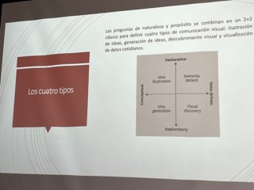
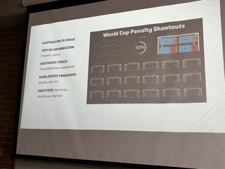
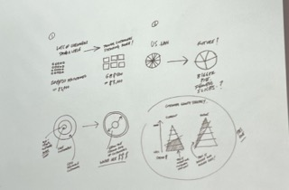

# Visualizacion de Datos
La info no nos sirve para nada si no la podemos ver de una buena manera.

Sin la correcta visualizacion de datos, detectar ineficiencias escondidads en los patrones,seria imposible.

# Core Data-Viz Concepts
- Iniciar con una pregunta a contestar. O una hipotesis. 
> Ej "LAs ventas de cerveza, aumentan los fines de semana"
- Minimalismo, simple pero no aburrido. 
- Tomar el grafico correcto. Basarnos en el estudio Andrew Abela o  oir William Cleveland.

 

# Enfoques
- La informacion es conceptual o basda en datos?
- Estoy declarando algo o explorando?
Estas preguntas nos ayudaran a panificar recursos, herramientas y a comenzar a decidir que tipo de visualizacion ayudara a lograr nuestros objetivos.

 ## **Enfoque: CONCEPTUAK**
 ### :Ideas
 ### Objetivos
 - Simplificar
 - Mostrar (Asi como esta estructurada la org)

 ## **Enfoque: BASADO EN DATOS**
 ### :Estadisticas
 ### Objeticos
 - Informar, ilustrar (Aqui estan nuestros ingresos de los ultimos años.)

## Enfoque: Declarativo
- Documentar, diseñar.
### Metas
- Afirmar (Aqui esta nuestro presupuesto por departamentos.)

## Enfoque: Explorativo
- Creacion de prototipos, iteracion, interaccion y automatizacion.
### Onbjetivos:
- confirmar (Veamos si las inversioes contribuyeron a aumentar las ganancias)
- Descubrir (Que veriamos si visualizariamos las compras de los clientes por genero, ubicacion, etc)

## Tipos

## Tipos

## Tableros Publicos
https://public.tableau.com/app/discover

## Generacion de Ideas
Los gerentes usan la visualizacion para generar ideas todo el tiempo: pizarras, papel o una servilleta.

La ilustracion se basa en metaforas, pero tiene lugar en entornos mas informales, como fuera sitios, sesiones y proyectos de invacion.

Utilizada para encontrar nuevas formas de ver el negocio y responder a desafios complejos.

## Generacion de Ideas
### Tipo de transformacion
- Complejo
- Definido
### Escenario Tipico:
- Sesiones de trabajo
- Luuvia de idea

