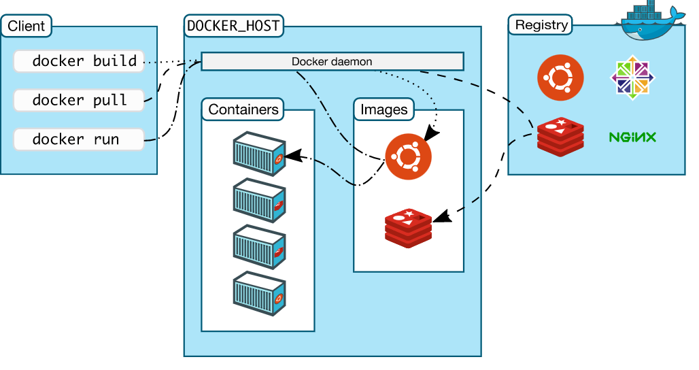
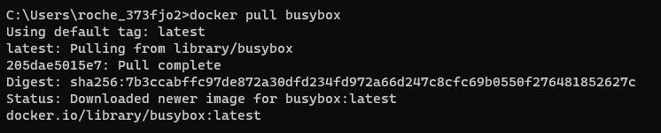
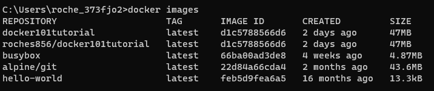
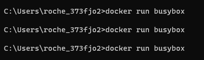
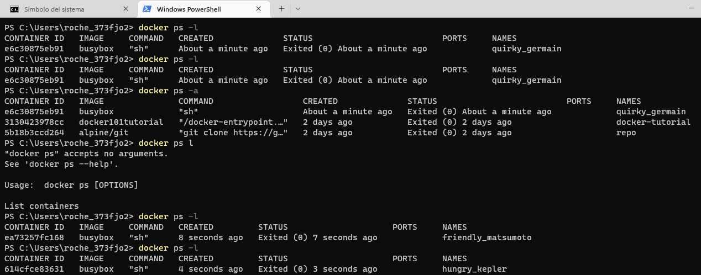
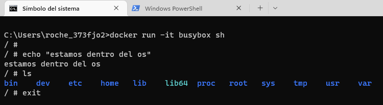

# Docker 101
## Componentes principales
- Runtime (daemon): el administrador y orquestador de contenedores.
- Registry:
    Store de contenedores y libreriras. El registro oficial. El repo donde descargamos las imagenes.
- Client (cli, giu)
## Arquitectura

## PULL
> docker pull <***imagen***>
Descarga la imagen de el registro cloud de docker. Clonamos la imagen en el host

## IMAGES
> docker images
Nos lista las imagenes que hemos pulleado.

## RUN
> docher run <nombrecontenedor> <cli>? 
Creamos una instancia de la imagen. Creamos el contenedor.

## START
> docker start <nombrecontenedor> 

Inicializa el contenedor
## STOP
> docker stop <nombrecontenedor> 

Detiene y baja el contenedor

## PS -a -l
### -a
Devuelve todos los contenedores
### -l
Devuelve los contenedores recientes.

## MODO ITERATIVO
> docker run -it busybox sh
Entramos al OS del contenedor 

