# Incaparina
- 62 años contributendo a la nutricion de guatemala
- presente en 9 de cada 10
- Canasta basica
- Segun KANTAR, es la 12va marca mas reconocida de guatemala.

## Innovacion
Es una marca que busca la innovacion como canal, la nutricion.
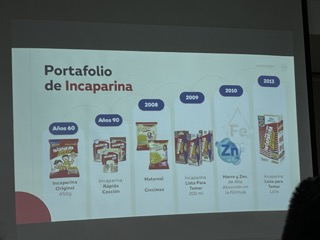

## Incaparina 900gr
- Exlsiva de WM
- Presentacion basada para minimizar el desabastecimiento del producto en el hogar.
- El consumidor pasa 5.6 dias sin producto en su halacena.
## Vitamina D
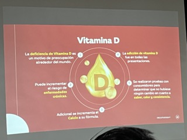

### Comunicacion con la prensa
- Se dieron a conocer las inovaciones con respecto a la vitamina D
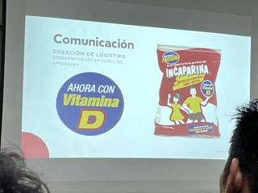

## Presentacion de Splenda
Es una nueva alternativa para personas con diabetes y cuidados con el azucar.

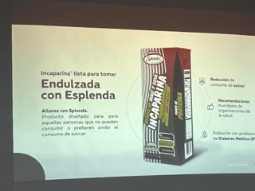
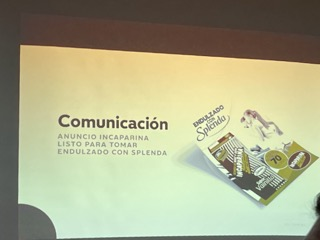

## Multicereal
Alternativa con sabor, instantantea y con enfoque en el semgmento joven de universitarios que trabajay estudian.

Rica y con sabor.

Base: Aventa, soja y arroz.

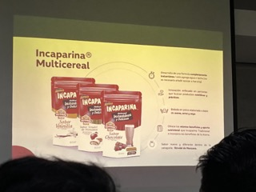

## Con Leche
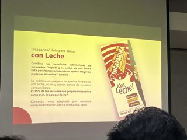
## Reduccion en contenido de Azucar Lista para Tomar
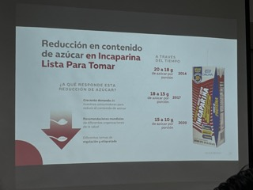

## Postpandemia
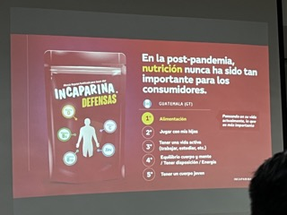
### Inmunidad
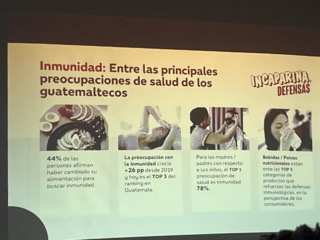
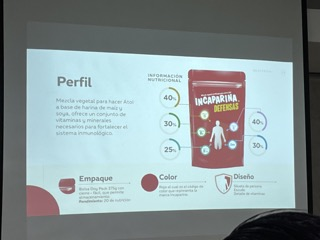
### Comunicacion
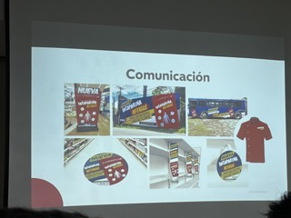

