# Distribuciones
Se estudiaran fenomenos que relacionan variables que nos permiten realizar predicciones hacia el guturo.

# P() MAYUSCULA = Distribucion
# p() minuscula = Probabilidad

## Sistemas

## Variables aleatorias / Aleatoriedad
Comportamiento probabilistico/estocastico en la realidad.
### Etapas
- Numeros aleatorios **R** distribuidos uniformemente.
- Utilizar **R** generar mediante una funcion de distribucion, las variables aleatorias.

## Ejemplo

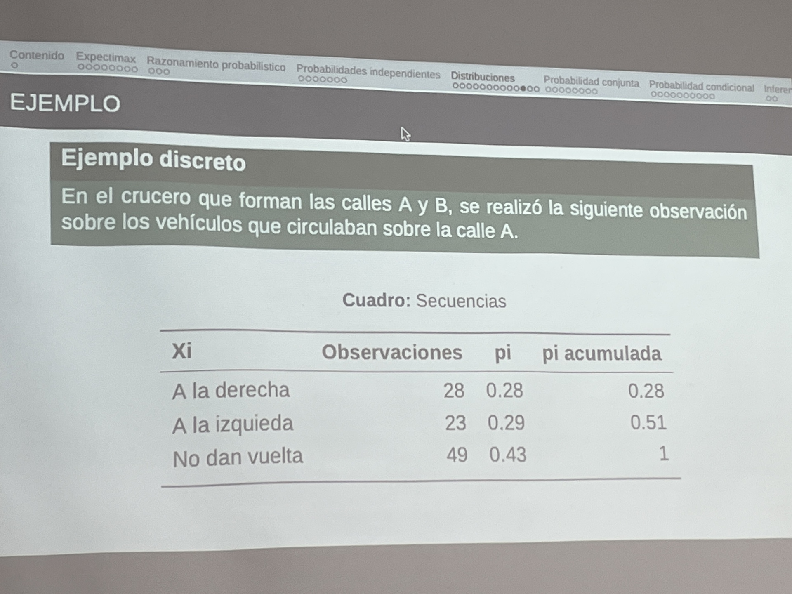
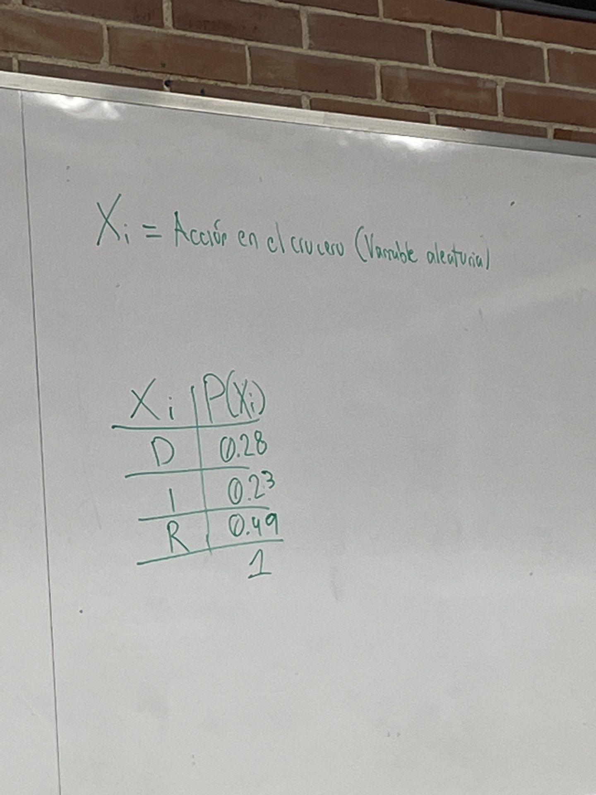

## Utilidades
 Integrales multiples, ecuciones diferenciales, sistemas de espera, programacion de horarios
 - Muestreo imposible para el presente o futuro
 - Secuenciales - Pseudo aleatorios

 ## Distrobucion Conjunta
 Especifica la probabilidad de que dos eventos sicedan (NO necesariamente dependiente)
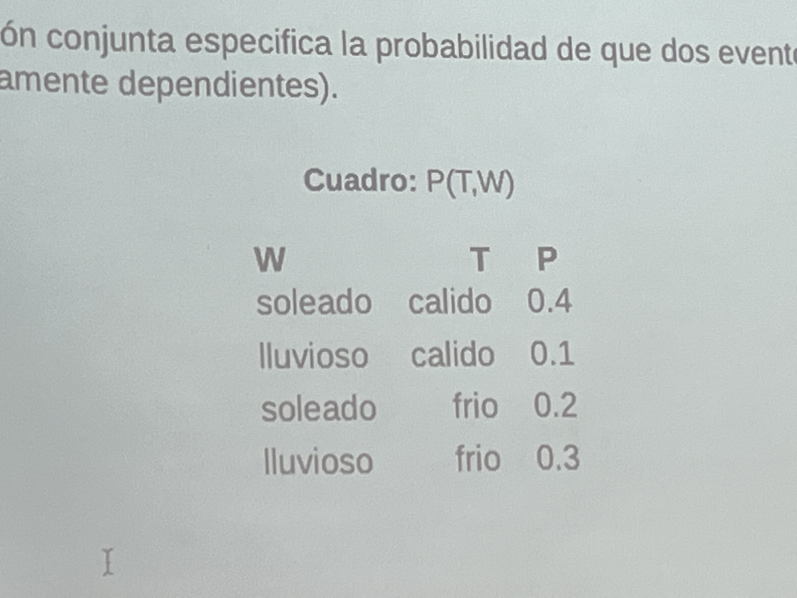
**Caracteristicas**:
- Una no desencadena otra
- 2 variables ocurren a la vez.
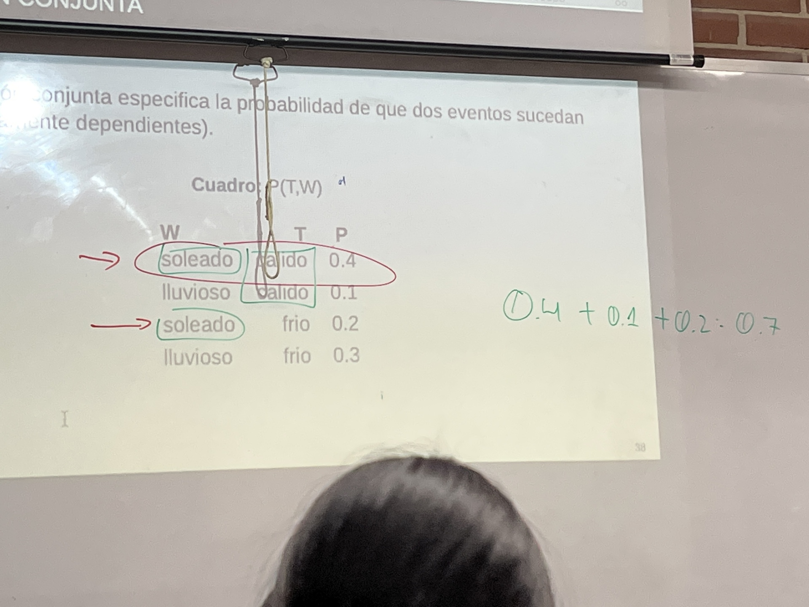

## Distribucion Marginal
Sub conjuntos (sub tablas) que eliminan valores

Marginalizar: Combinar tablas hacia las originales.
Marginalizacion: Eliminar variables a travez de una sumatoria.
### Ejemplo Marginalizacion
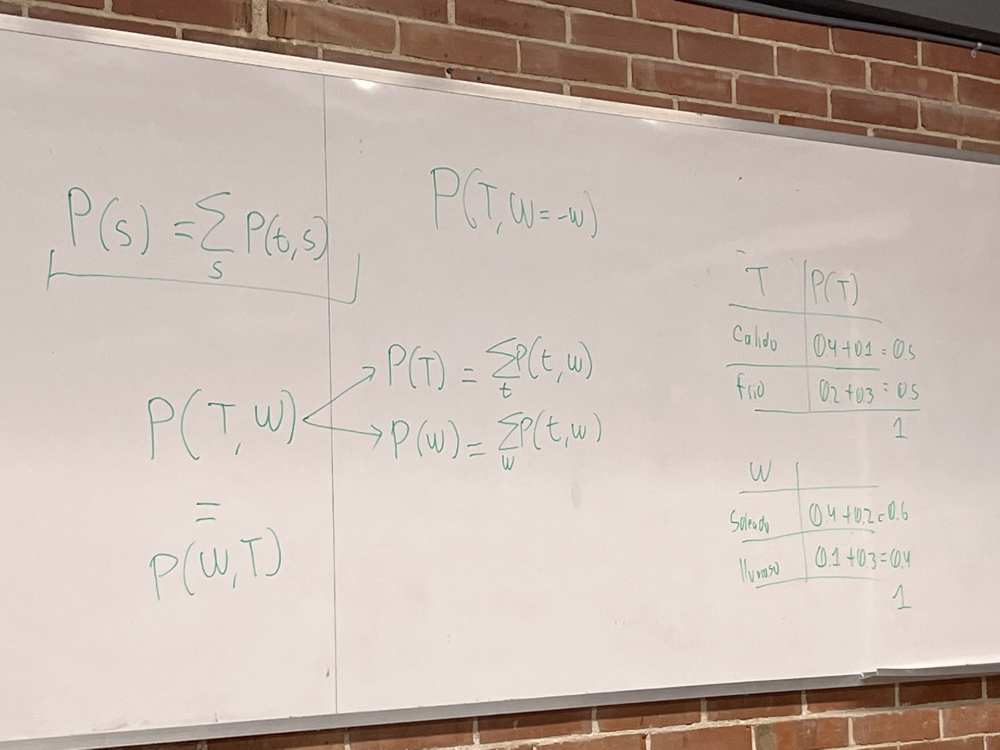

## Probabilidad Condicional
Si conocer el valor de una variable influye en la causalidad de otra variable.

Distribucion de probabilidad dada una distribucion conjunto, considerando uno de los elementos como fijo.

> *P(A|B)* => Probabilidad de ***A*** si tengo ***B***

> *P(B|A)* => Probabilidad de ***B*** si tengo ***A***

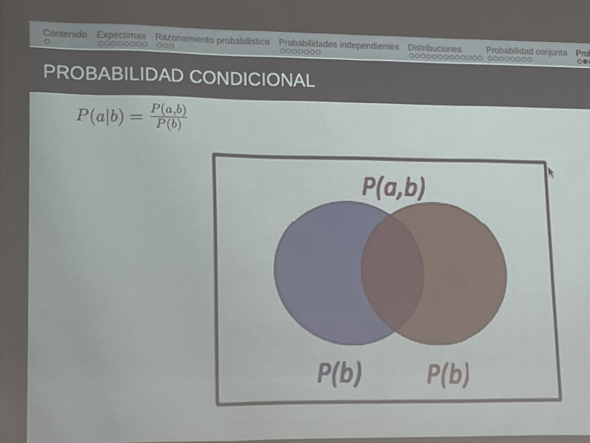
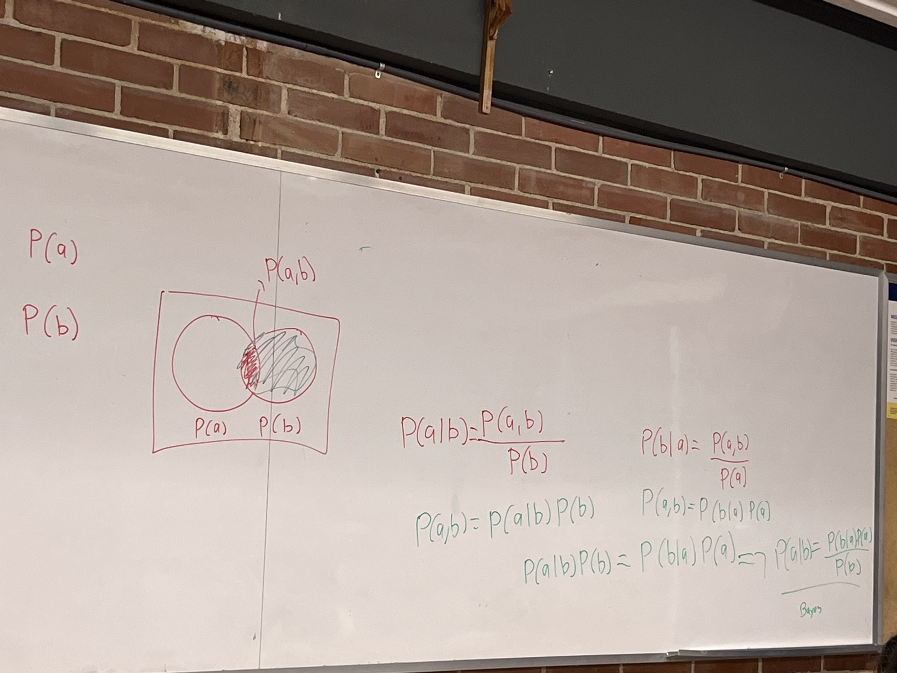

### Ejemplo:
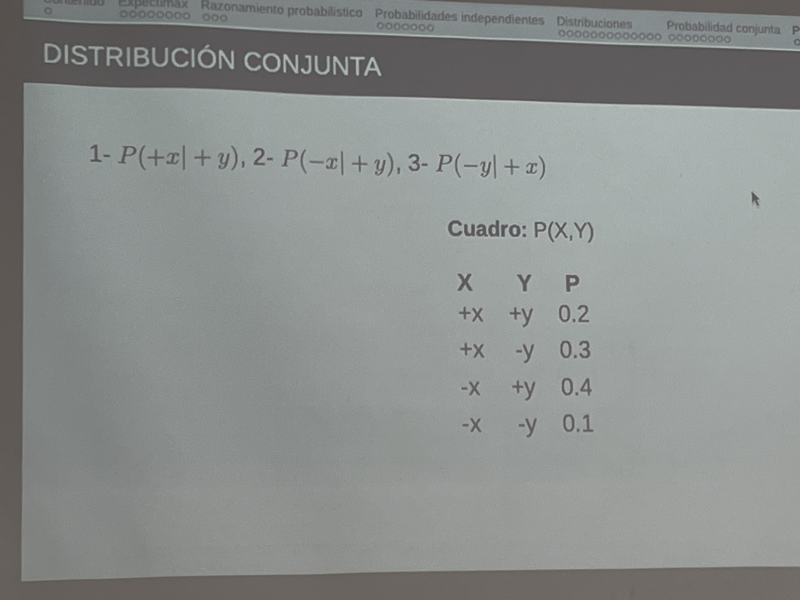
1. P(x|y)

2. P(-x|y)

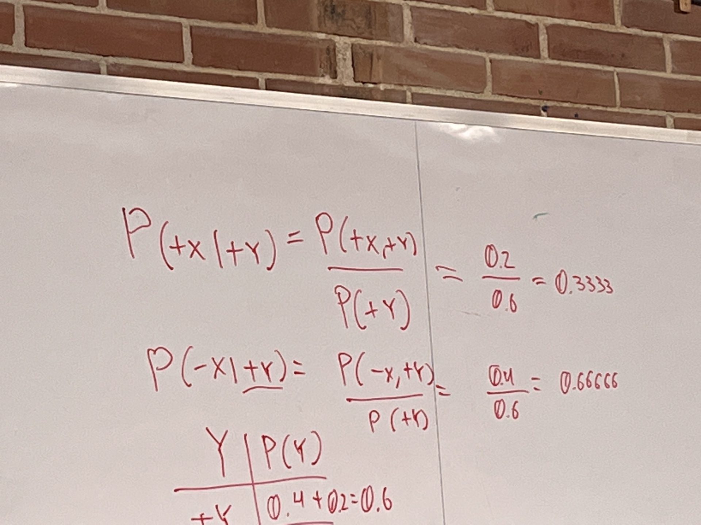

3. P(x|-y)
### MArginalizacion conjunta Normalizada
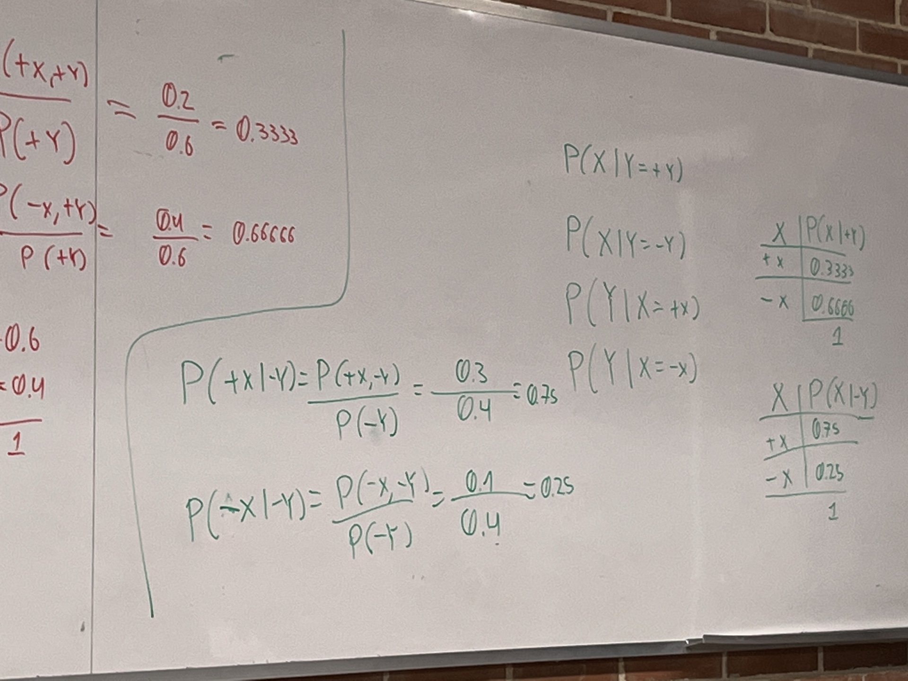

## DISTRIBUCION != PROBABILIDAD

Probabilidad: Valores puntuales.    P(X|y)
Distribucion: Es la ta bla completa. P(X|Y)
## Ejemplo Completo

- Marginalizamos T

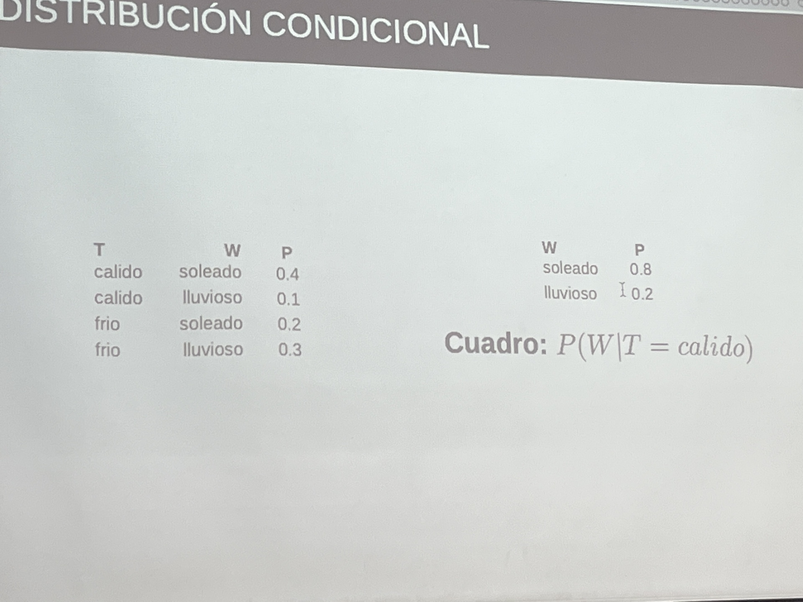
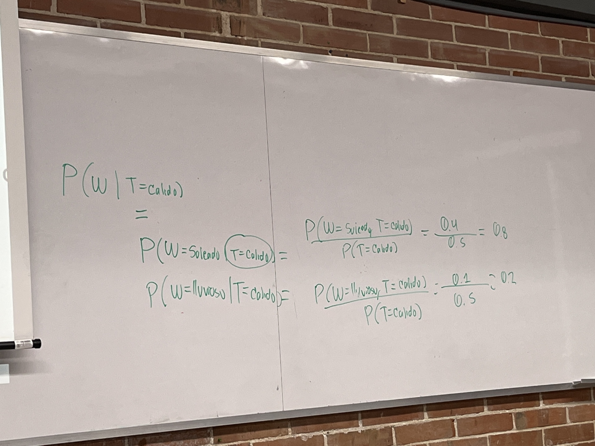

