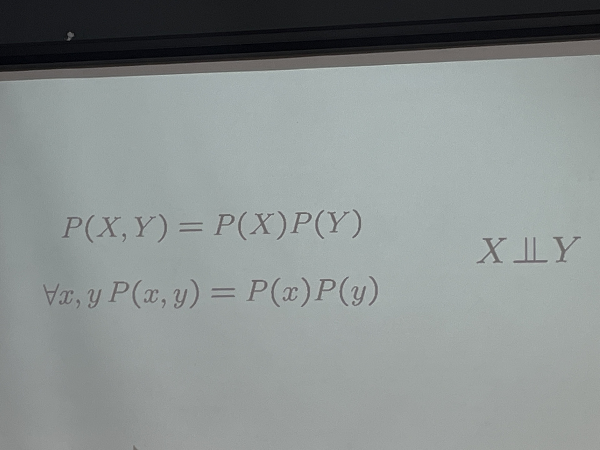

# Modelos Bayesianos
La distribucion conjunta es igual a la multiplicacion de ambos.

- Solo se sotiene si X y Y son independientes
- Es dificil que en los modelos bayesianos existan variables totalmentes independientes.
- 
> P(X,Y) = P(X) P(Y)

## Independencia

# Redes de Bayes
> Topolofia/grafo + Probabilidades **condicionales** locales
Tendencias para describir distribuciones **conjuntas** complejas (modelos), usando distribuciones locales (probabilidades **condicionales**.)
- Para estas config, la regla de la cadena no funciona.

- Un conjunto de nodos que representan variables aleatorias
- Un grafo aciclico (no es cicloco)
- Una ditribucion condicional para cada nodo

