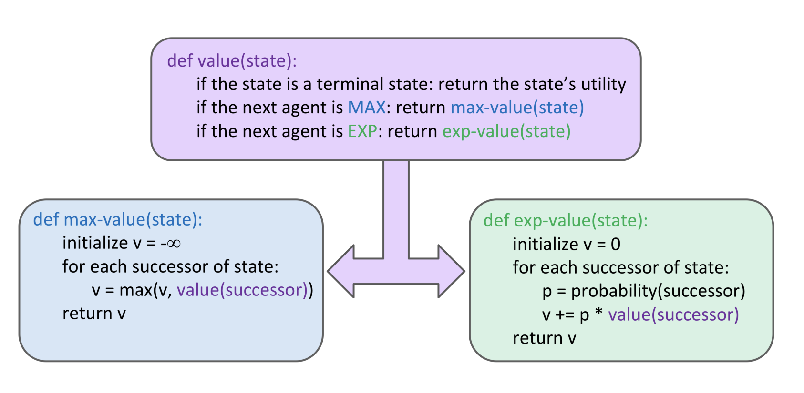

# Asignacion de Valores
## Definicion
- El camino es lo importante
- Costo y profundidad
- Heuristica especifica para guia

Identificacion: Asignacion de variables
- Asignacion es lo mas importante
- El costo de los caminos pude tener el mismo camino
- CSP especificos para problemas de identificacion

## Problemas de busqueda
### Normal
- black box, saber si ya llegamos al final
- Goal test: Cualquier configuracion
- Funcion Susecion- Cualquier
### CSP
- Estados = Variables X, con dominio D que puede depender de i
- Goal Test = Serie de requisitos constraints que especifican las posibles combinaciones

- Variables(cajitas donde guardar)= W A, NT, SA, etc etc

- Dominio (que se les puede asignar): R,G,B (discreto o continuo)
    - Dominio: que valores puede adquirir
- Requisitos: reglas que debe cumplir
    - Implicito
- Soluciones: Asignan configuracinoes que satisfacen las limitantes

## Binary CSP
Cada requisito se ralaciona como maximo 2 variables. Restricciones binarias.

# Resolucion de Problemas
1. Analisis
2. Hipotesis y posibles futuros
3. Opciones y futuro impacto
4. Prueba y error
## Como resolvemos
- Prueba y error
- Tercerizacion
- Planificacion
    - Serie de pasos para llegar a una meta

## Agentes que resuelven problemas
- Agentes que planifican
- Problemas de busqyeda
- Metodos regulares y asistidos

## Reflex Agent
- Resuelven sus problemas en base a la persepcion inmediata
- No consieran las consecuencias de las accinoes
- Actuan en base como el mundo ES en el momento que deben decidir
## Planing Agents
- Que pasaria si?
- Desiciones basadas en hipotesis
- Necesitan un modelo de como el mundo reacciona a las acciones 
- Debe tener un objetivo y ptobalo
- Consideran como el mundo debe ser.

## Algoritmo de busqueda
### Optimo vs Completo
- Optimo: llega o no a la solucion, la mejor solucion. Alto costo
- Completo: Solamente llega al objetico

### PLanificacion  vs Replanifican
- PLanificacion: Futuros posibles y avanzas
- Replanifican: Decidir en cuantos niveles un que pasaria si

## Tipos de Variables

# Algoritmos de busqueda
## ***UC***
Medimos el costo acumilado

BFS (Breadth First Search) y DFS (Depth First Search) son dos algoritmos de búsqueda en grafos que se utilizan para recorrer los nodos de un grafo en busca de un valor o una solución determinada. La principal diferencia entre ambos es la forma en que se recorren los nodos:

## ***BFS*** 
se recorre el grafo por niveles, es decir, primero se visitan todos los nodos hijos de un nodo, luego todos los hijos de los hijos, y así sucesivamente. BFS es una búsqueda en amplitud.

## ***DFS*** 
se recorre el grafo en profundidad, es decir, se profundiza en un nodo hasta que no se pueda ir más lejos y luego se retrocede para continuar con otro nodo. DFS es una búsqueda en profundidad.

Ambos algoritmos tienen diferentes aplicaciones y ventajas según el problema que se quiera resolver. Por ejemplo, BFS es útil para encontrar la solución más corta en un grafo no ponderado, mientras que DFS es útil para encontrar una solución rápidamente en grafos muy grandes.

## ***Iterative DeepSearch***
DF con limities iterativos.

Por niveles

## ***A****
Heuristica = Asitencia, sugerencias y asistencia. Que tanto me estoy acercando a la meta.

Dependiente al probema.

La heuristica tiene que ser precalculada.

Greedy Search: Toma solamente la euristica. Tomar la mas baja, me estoy acercando.
> g(x) euristica
> h(x) Costo del camino
A* = g(x) UC + h(x) Greedy

# Expectimax

