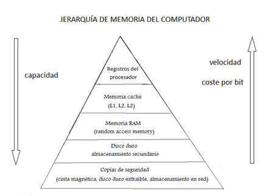

# Jerarquia de Memoria

## Registros
Apuntador para guiar las memorias
## Cache
- Que registro queres guardar?
- Intermediario entre registros y la memoria principal.
- Invisible para el OS
- Volatil y muy rapida
- n/K => registros sobre bloque
- 2**n*K (n: # registros, K: # Bloques) => Ghz velocidad de la cache
## RAM (Principal)
Factores principales
- Cantidad de memoria 
- Velocidad
- Costo de procesamiento
- Tiempo en procesar y acceder
Cuantas operaciones puedo realizar en cuestion de tiempo? Qe tan eficiente es?

