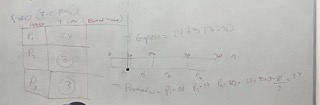

# ***Sistema Operativo***
Un programa que maneja las istrucciones basicas entre el hawrdware y el software que corre sobre el.
## Funciones Basicas
. Administracion de los procesos
- Manejo de archivos
- Seguradad
- Control de I-O y perifericos
- Administrar los Recusos
- Es un modelo simple limpio y sencillo de utilizar.

## Metas
- Brindar un entorno amigable para el usuario
- Gestionar el hardware
- Gestionar las instrucciones de bajo nivel.
## Registros
Es una memoria interna dentro del procesador o componente. Esta me permite acceder agilmente a la informacion facilmente y las peraciones que voy a operar.

##  Tipos de Registros
En un sistema operativo, hay varios tipos de registros que se utilizan para controlar el funcionamiento del sistema y la ejecución de programas. A continuación se presentan algunos de los tipos más comunes de registros en un sistema operativo:

- **Registros de propósito general**: Estos registros se utilizan para almacenar datos temporales y direcciones de memoria durante la ejecución del programa. Los registros de propósito general pueden ser utilizados por el programa de usuario o por el sistema operativo.

- R**egistros de estado**: Estos registros se utilizan para almacenar información sobre el estado actual del sistema, como el estado de los flags de la CPU, la condición de los dispositivos de entrada/salida, y el estado de los procesos.

- **Registros de índice**: Estos registros se utilizan para almacenar los índices de acceso a la memoria y los vectores de interrupción.

- **Registros de segmento**: Estos registros se utilizan para almacenar información sobre los segmentos de memoria que se están utilizando en la ejecución del programa.

- R**egistros de control**: Estos registros se utilizan para controlar la operación del sistema, como la habilitación y deshabilitación de interrupciones, el establecimiento de prioridades de procesos y la gestión de la memoria.

- **Registros de punto flotante**: Estos registros se utilizan para realizar cálculos con números en coma flotante.

# Proceso
Es un conjunto de instrucciones que se ejecutan a nivel de sistema operativo.

## Estados de los Procesos
New: proceso creado -> Listo
Listo: proceso ya creado, ya esta en la pila ->
Ejecutado: 
Bloqueado: cuando se detenca interbloqueo
Terminado

Va en este orden:
- Stack: 
    - Pila, segun el estado, asi se va a guardar en la pila.
    - En finalizado ya no se guarda en le pila. Solamente estado listo, preparado o ejecucion.
- Heap: Direaccion de memoria dinamica
- Data: Variables que maneja el proceso
- Text: Instrucciones de donde donde se va a ejecutar

## Tipos de Pilas de Procesos
- Proc List: Son las que estan ejecutandose.
- Proc Block: Son las que estan bloqueados.
- Cont: Es la pila que guarda todos los procesos y se envarga de moverlos de una pila a otra.

# Ciclo de Vida de una instruccion
1. el core trae las isntrucciones una por una
2. ejecuta las instrucciones

> Inicio -> Leer (read) -> Ejecutar (write) -> Fin
- Las intrucciones se ejecutan linealmente, es decir, una por una. van en cola. Pero el orden en el que entran no es el orden en el que se ejecutan.

# Instruccion
Una instrucción es **una orden o comando** que se ejecuta para realizar una tarea específica. En el contexto de un SO, las instrucciones suelen ser emitidas por programas de software o por el propio SO para controlar el funcionamiento de la computadora.

## Tipos de interrupciones
- Programa: Cualquier programa
- Entrada Salida: Dispositivo o modulo
- Reloj: CPU, reloj
- Falla de Hardware: Dispositivo Hardware

# Ciclo de vida de una instruccion
> ***Start*** -> read -> Exec (***fin*** habilitada?  ) -> Comprobar  

Comprobar: Verificar de donde viene la interrupcion.

# Tecnicas de Comunicacion
## Programadas
Reponsabilidad del procesador estar verificando el estado del modulo de entrada y salida.

Hasta que el sepa que esatn disponibles <, en funcionamiento o si estan ocupados.

El procesador extrae le info de E/S y la deposita  en la memoria.

## Interrupciones
El procesador envia la peticion.
El encargado es el modulo E/S hasta que llegue la peticion, la toma y la libera.

Esto es para que el procesador tenga mas recusos para operar otras instrucciones.
## DMA (Direct Memory Acces) 
El encargado es la memoria, hace de mediador entre el procesador y el Modulo

# System Calls
# Llamadas de sistema
Son una **interfaz proporcionada por un sistema operativo para que los programas de usuario puedan solicitar servicios y recursos del sistema**. 

Permiten a los programas de usuario acceder a los servicios y recursos del sistema operativo, como la creación y gestión de procesos, la gestión de archivos y dispositivos de entrada/salida, y la gestión de la memoria.

Las llamadas al sistema **permiten a los programas de usuario interactuar con el sistema operativo de una manera controlada y segura.** 

En resumen, las llamadas al sistema son una parte crítica de la interfaz entre los programas de usuario y el sistema operativo. Permiten a los programas de usuario acceder a los servicios y recursos del sistema de una manera controlada y segura, y son esenciales para la funcionalidad y el rendimiento de los sistemas operativos modernos.

Algunos ejemplos de llamadas al sistema incluyen:

- Crear un proceso o hilo de ejecución
- Abrir y cerrar archivos
- Leer y escribir en archivos
- Asignar y liberar memoria
- Configurar dispositivos de entrada/salida
- Gestionar la red y la conectividad
- Acceder a recursos de hardware

# Threads
Un hilo dentro de un procesador es la forma en que cada uno de los núcleos del CPU recibirá y procesará la información. 

Cada núcleo puede solamente realizar una tarea a la vez y en a pesar de que un procesador, por poner un ejemplo, de ocho núcleos tenga 16 hilos, este comportamiento sigue siendo el mismo.

## Tipos Hilos
### Single Proces Thread:
Tenemos un Hilo por un proceso, donde compartimos la pila, los datos y los registros.
### Multi Proces

## Tipos Usuario
Programar:

- Mx1: varios hilos de usuario a 1 hio de kernel. Tambien es multi 
- 1x1: or cada hilo de usuario, vamos a tener un hilo de kernel asignado Single process Thread
- MxM: varios hilos de usuario a 1 hio de kernel. Multiproces Thread

# Jerarquia de Memoria

## Registros
Apuntador para guiar las memorias
## Cache
- Que registro queres guardar?
- Intermediario entre registros y la memoria principal.
- Invisible para el OS
- Volatil y muy rapida
## RAM (Principal)
- n/K => registros sobre bloque
- (2**n)/K (n: # registros, K: # Bloques) => capacidad de cache para almacenar
- Capacidad maxima es de 64MB
- Capacidad minima es de 16MB
- Es poca memoria por que es volatil

Factores principales
- Cantidad de memoria 
- Velocidad
- Costo de procesamiento
- Tiempo en procesar y acceder
Cuantas operaciones puedo realizar en cuestion de tiempo? Qe tan eficiente es?

# Esquenmas de Planificacion
## Por Lotes
Se conoce como sistema por lotes (en inglés batch processing), o modo batch, a la ejecución de un programa sin el control o supervisión directa del usuario que se denomina. Este tipo de programas se caracterizan porque su ejecución no precisa ningún tipo de interacción con el usuario.
## Interactivos
Se realizan un proceso y se espera una respuesta.
## Tiempo real
- Reespuestas inmedias y respuestas observables a nivel de procesos.
- Ni mediado, corto o largo plazo.
- No hay planificacion.

# Criterios de Planificacion
Criterios que toma la planificacion para ejecutar los procesos.

Son jerarquicos.

## Utilizacion CPU 👇 
Que cantidad de CPU me va a consumir?

## Rendimiento 👇 
Me estoy exediendo de los limites que puedo utilizar en el proceso?
Revisar el del disco duro.

## Tiempo de espera, es acumilativo

## Tiempo de Retorno👇
- Cantidad de tiempo que me va a tomar devolver una respuesta de un proceso.

- Acumulativo
- Si se tarda mucho, e 
- Es por cola, se toma el tiempo de todos los procesos.

## Tiempo de Respuesta
- Invervalo de tiempo en que un proceso se tarda en responder.
- Tiempo de ejecucion.
- Es el tiempo individual de cada proceso. 

## Tipos
### Apropiativos
Nadie le quitar el proceso, aunque me haga daño.
### Expropiativo
Tomamos el proceso, lo trato de ejcutar, pero como me perudica, lo suelto.
 
## FIFO

## Por Prioridad

## Inadmicion
Cuando un proceso con baja prioridad puede ser que nunca se ejecute.

Como tiene poca prioridad, entran procesos mas altas y nunca se procesan por su bajo nivel de prio.

### Prioridades Iguales
- Se toma el que entra primero (tiempo de llegada)  
- El tiempo de CPU mas pequeño
- Tiempo de ejecucion

## QUANTUM
Tiempo de procesador que le da al proceso para poderse ejecutar.

Si no se ejecuta en ese tiempo, lo manda a la cola de espera y pasa a otro proceso.

Lo saco de la cola "Listos" y avanzo con el siguiente proceso.

## Round robin
Es un algoritmo que le da un tiempo (Q (Quantum).

Si los procesos tienen mas tiempo de CPU es mayor, se fragmenta y se pasa a la cola de listos.

## FIFO vs RR
FIFO es mas rapido que Round Robin

## REsolver inadmicion
Los prrocesos se van a enviar a diferentes Colas.

Calsificacndo el proceso por sus caracteristicas, se van moviendo colas a diferentes.
- Colas 

## ASPM
colas de usuario y sistema
## 
Colas en trabajo y listo 

# Planificacion Multiproceador
- Cola unica
    - El CPU decide que proecsos 
    - Un proceso que no cumpla las caracteristicas, rechaza el proceso.
- Cada WCP-CPU
    - El cpu decide cuales va a ejecutar
    - el cpu decide el tiempo para ejecutar