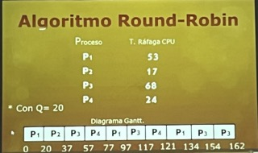

# Esquenmas de Planificacion
## Por Lotes
Se conoce como sistema por lotes (en inglés batch processing), o modo batch, a la ejecución de un programa sin el control o supervisión directa del usuario que se denomina. Este tipo de programas se caracterizan porque su ejecución no precisa ningún tipo de interacción con el usuario.
## Interactivos
Se realizan un proceso y se espera una respuesta.
## Tiempo real
- Reespuestas inmedias y respuestas observables a nivel de procesos.
- Ni mediado, corto o largo plazo.
- No hay planificacion.

# Criterios de Planificacion
Criterios que toma la planificacion para ejecutar los procesos.

Son jerarquicos.

## Utilizacion CPU 👇 
Que cantidad de CPU me va a consumir?

## Rendimiento 👇 
Me estoy exediendo de los limites que puedo utilizar en el proceso?
Revisar el del disco duro.

## Tiempo de espera, es acumilativo

## Tiempo de Retorno👇
- Cantidad de tiempo que me va a tomar devolver una respuesta de un proceso.

- Acumulativo
- Si se tarda mucho, e 
- Es por cola, se toma el tiempo de todos los procesos.

## Tiempo de Respuesta
- Invervalo de tiempo en que un proceso se tarda en responder.
- Tiempo de ejecucion.
- Es el tiempo individual de cada proceso. 

## Tipos
### Apropiativos
Nadie le quitar el proceso, aunque me haga daño.
### Expropiativo
Tomamos el proceso, lo trato de ejcutar, pero como me perudica, lo suelto.
 
## FIFO

## Por Prioridad

## Inadmicion
Cuando un proceso con baja prioridad puede ser que nunca se ejecute.

Como tiene poca prioridad, entran procesos mas altas y nunca se procesan por su bajo nivel de prio.

### Prioridades Iguales
- Se toma el que entra primero (tiempo de llegada)  
- El tiempo de CPU mas pequeño
- Tiempo de ejecucion

## QUANTUM
Tiempo de procesador que le da al proceso para poderse ejecutar.

Si no se ejecuta en ese tiempo, lo manda a la cola de espera y pasa a otro proceso.

Lo saco de la cola "Listos" y avanzo con el siguiente proceso.

## Round robin
Es un algoritmo que le da un tiempo (Q (Quantum).

Si los procesos tienen mas tiempo de CPU es mayor, se fragmenta y se pasa a la cola de listos.

## FIFO vs RR
FIFO es mas rapido que Round Robin

## REsolver inadmicion
Los prrocesos se van a enviar a diferentes Colas.

Calsificacndo el proceso por sus caracteristicas, se van moviendo colas a diferentes.
- Colas 

## ASPM
colas de usuario y sistema
## 
Colas en trabajo y listo 