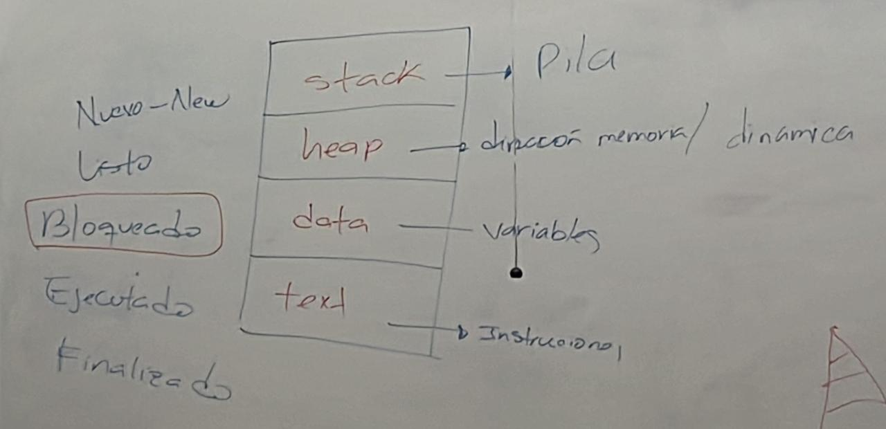

# Proceso
Es un conjunto de instrucciones que se ejecutan a nivel de sistema operativo.

## Estados de los Procesos
New: proceso creado -> Listo
Listo: proceso ya creado, ya esta en la pila ->
Ejecutado: 
Bloqueado: cuando se detenca interbloqueo
Terminado

Va en este orden:
- Stack: 
    - Pila, segun el estado, asi se va a guardar en la pila.
    - En finalizado ya no se guarda en le pila. Solamente estado listo, preparado o ejecucion.
- Heap: Direaccion de memoria dinamica
- Data: Variables que maneja el proceso
- Text: Instrucciones de donde donde se va a ejecutar

## Tipos de Pilas de Procesos
- Proc List: Son las que estan ejecutandose.
- Proc Block: Son las que estan bloqueados.
- Cont: Es la pila que guarda todos los procesos y se envarga de moverlos de una pila a otra.
